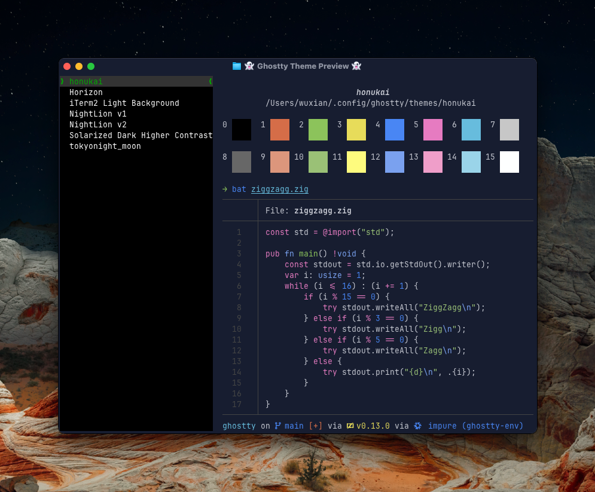

# Honukai for Ghostty
Honukai theme and colors for Ghostty, ported from [honukai-iterm-zsh](https://github.com/oskarkrawczyk/honukai-iterm-zsh)



# Installation

1. Copy the `honukai` file to `$XDG_CONFIG_HOME/ghostty/themes` or `$PREFIX/share/ghostty/themes`.
2. Set the theme in config:
```
theme = honukai
```
